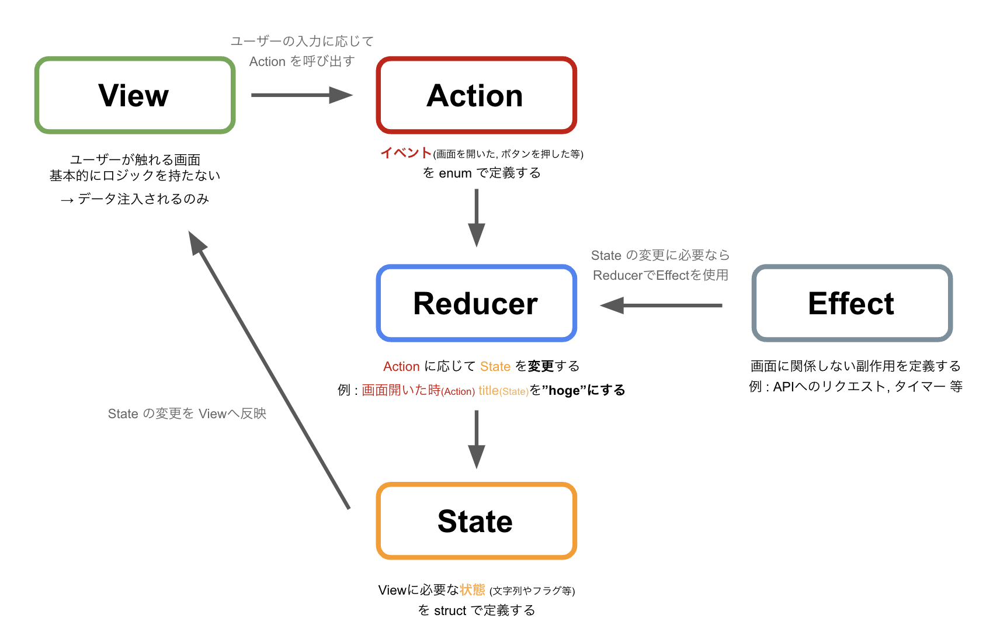
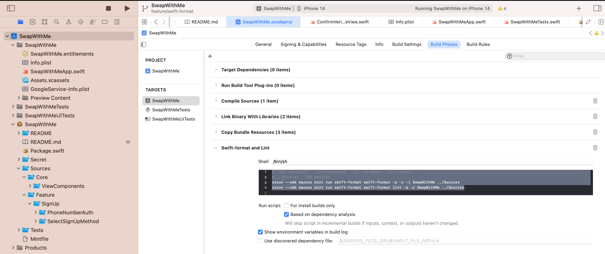

# SwapWithMe


## TCA




SwapWithMe では`TCA`を採用しています。`TCA`はpointfreeの[README](https://github.com/pointfreeco/swift-composable-architecture#user-content-what-is-the-composable-architecture)にあるように、状態管理を目的としたフレームワークです。
`View`, `Action`, `State`, `Reducer` によって画面の状態を管理しています。アーキテクチャとしては SwiftUI版のRedux のような立ち位置だと考えています。

TCAの採用理由としては以下の3点です。
- 実装方針を限定できること
    - `Action` や `State` 等 状態の定義が限定されているため、長期的 や 複数人 での実装を考えると実装者による癖がコードに反映されにくい
        - 制約が多い分実装のブレが生じにくい
- テストの書きやすさ
    - Action に沿って State の変化をテストするという流れが明確である
    - DI の体制も整っている
- キャッチアップのため
    - ドキュメントが整っている

### オンボーディング
TCAの入門となるオンボーディングを作成してみました。
TCA を用いた開発を行う前に、一度確認してみてください。

`概要` : GitHubリポジトリ一覧を表示する ※<br>
`内容` : 画面を開いた時にGitHubAPIからリポジトリを取得する<br>
※ Viewの実装は行いません。以下に示す実装内容としてはTCAによるデータフローの確認を行う程度のものです。

**RepositoryView.swift**

`View`

```RepositoryView.swift
import ComposableArchitecture
import SwiftUI

// MARK: - View

struct RepositoryView: View {
    // store の初期化
    let store: StoreOf<RepositoryStore>
    public init(store: StoreOf<RepositoryStore>) {
        self.store = store
    }

    var body: some View {
        // Store の呼び出しを可能にする
        // Action や State へのアクセスが可能となる
        // State に変更があると 自動的にViewへ反映される
        // viewStore : let viewStore: ViewStore<RepositoryStore.State, RepositoryStore.Action>
        WithViewStore(self.store, observe: { $0 }) { viewStore in
            ZStack {
                // State を View へ反映させる
                Text(viewStore.ripositories[0])
            }
            .onAppear {
                // Action の発行
                viewStore.send(.onAppear)
            }
        }
    }
}

// Preview
struct RepositoryView_Previews: PreviewProvider {
    static var previews: some View {
        // Store を渡す必要がある
        RepositoryView(
            store: Store(initialState: RepositoryStore.State()) {
                RepositoryStore()
            }
        )
    }
}
```

**RepositoryStore.swift**

`State`, `Action`, `Reducer`

```RepositoryStore.swift
import ComposableArchitecture

// MARK: - Store (State, Action, Reducer)

public struct RepositoryStore: Reducer {
    // Store を外部からアクセス可能にする
    public init() {}

    // MARK: - State

    public struct State: Equatable {
        public init() {}

        var ripositories: [String] = [""]
    }

    // MARK: - Action

    public enum Action: Equatable {
        case onAppear
    }

    // MARK: - Reducer

    public var body: some ReducerOf<Self> {
        Reduce { state, action in
            // 1 : Action に応じて
            switch action {
            case .onAppear:
                // 2 : State を変更する
                state.ripositories = ["repository1"]
                return .none
            }
        }
    }
}
```


## SPMマルチモジュール構成

プロジェクトの構成として SPMを中心としたマルチモジュール を採用しています。[pointfreeco/isowords](https://github.com/pointfreeco/isowords)を参考にしています。
プロジェクト構成は以下の通りです。構成を確認したい場合は、[Package.swift](https://github.com/hamadayuuki/SwapWithMe/blob/main/Package.swift) から確認してください。

```
.
├── App
│   ├── Package.swift
│   ├── SwapWithMe
│   ├── SwapWithMe.xcodeproj
│   ├── SwapWithMeTests
│   └── SwapWithMeUITests
├── Package.swift
├── README.md
├── Sources   // SPM
│   └── Feature   // Module
└── Tests
```
※ 現在 Feature同士がお互いの存在を知っている状態で画面遷移を実装しています。今後 `MainAppにて画面遷移を実装` + `抽象化 `+ `Swift-dependenciesを用いたDI` によって画面遷移を実装予定です。

### テストについて

#### TestPlan を作成しテストを実行する

SPMマルチモジュール構成を採用するとモジュールとしてテストを書くため、`TestPlan` を作り モジュール(テスト)毎にテストするかを明示的に指定する必要があります
指定しない場合、テストコード上に `♦︎マーク` が出てこないため、テストを実行できません

 1: `Product` > `Test Plan` > `New Test Plan ...`<br>
 2: 作成された Test Plan へ移動<br>
 3: 画面左下の + を押し > `対象のテストモジュール` を追加<br>
 4: スキームセルを押す > スキームを Project(SwapWithMe)にセット > `Edit Scheme` > `Test` > Test Plan に1で作成した`対象のTestPlan`が含まれているか確認 > 含まれていない場合 `+ボタン(Add Exisiting Test Plan` から追加<br>
 
 #### Pakage.swift の変更
 
 テストをリリースするパッケージ(今回でいうとSwapWithMeというアプリ)にテストを含めないようにする
 
 ```diff
 Package(
    name: "SwapWithMe",
    platforms: [.iOS(.v15)],
    products: allTargets
+        .filter { $0.isTest == false }   // リリースするパッケージにテストを含めない
        .map{ $0.name }
        .map{ .library(name: $0, targets: [$0]) },
    dependencies: packageDependencies,
    targets: allTargets
)
```


### Bitrise
Bitrise にてテストの自動実行を行なっています。
Workflow は以下の通り。2つのScriptはそれぞれ `brew install mint`, `mint bootstrap` です。


`追記(2024/2/7)` : 2つのScript後 に Scriptを追加 しています。追加したScriptは `defaults write com.apple.dt.Xcode IDESkipMacroFingerprintValidation -bool YES` で、追加理由は Macros をCI上で使用するためにCompiler Pluginの実行許可することです。


## 実行環境設定

### Xcode

前提として、`Xcode@14.3` と `homebrew` はインストールされているものとします。

### Format & Lint

#### 1. homebrew で mint をインストール

CLI は mint で管理しています。
CLIには[apple/swift-format](https://github.com/apple/swift-format)が含まれます。

Appleが公開しているコード整形ライブラリ。swift-formatの整形規則は[.swift-format](https://github.com/hamadayuuki/yumemi-ios-engineer-codecheck/blob/main/.swift-format)に記述しています。

```sh
brew install mint
```

#### 2. Mintfile を記述

Mintパッケージマネージャを使用してSwiftコマンドラインツールを管理する際に使用されるファイル

```Mintfile
apple/swift-format
```

#### 3. mint で管理している CLI をインストール

Mintfile に書かれている CLI がインストールされます。インストールした CLI は `mint run <command名>` で実行可能です。

```sh
cd プロジェクト
mint bootstrap
```

#### 4. swift-fomatを使用した自動整形の実行

`Xcode > Bulid Target(iOSEngineerCodeCheck) > Bulid Phases > +`> New Run Script Phase > "Swift-format and Lint"



Bulid Phases に `Swift-format and Lint` という名称で、以下の自動実行用のスクリプトを書く。

ビルドされるたびに以下のスクリプトが実行される。
SwapWithMe : XCodeProjのswiftファイル
../Sources : SPM モジュールのswiftファイル

```sh
# `-p/--parallel` `-r/--recursive` `-i/--in-place` `-s/--strict`
# ../Sources : SPM modules
xcrun --sdk macosx mint run swift-format swift-format -p -r -i SwapWithMe ../Sources
xcrun --sdk macosx mint run swift-format swift-format lint -p -r SwapWithMe ../Sources
```
